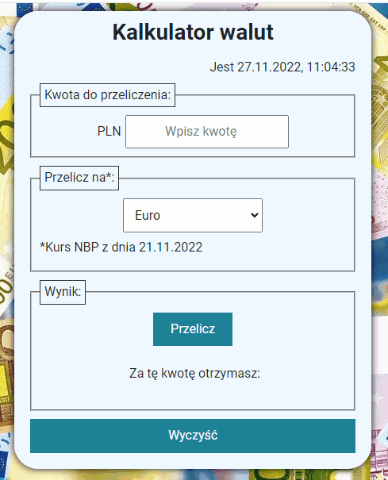

# Kantor2.0 in React

## Demo version: 
https://grzegorzpacewicz.github.io/currency-conventer-react/

## Basic Info
The project I make during FrondEndDeveloper course: https://youcode.pl/frontend-developer-od-podstaw

## Mannual

1. Put amount of currency you want to exchange in the field "Kwota do przeliczenia"
2. Choose currency in the field "Przelicz na"
3. Press "Otrzymasz" to see how much money You will get.
4. Press "Wyczyść" to reset form.

## Technologies used
- html
- css
- js
- BEM
- flex
- grid
- arrow functions
- md
- JSX
- React
- local storage
- styled components
- custom hook: useRef, useState, useEffect
- axios, API

## Getting Started with Create React App

This project was bootstrapped with [Create React App](https://github.com/facebook/create-react-app).
