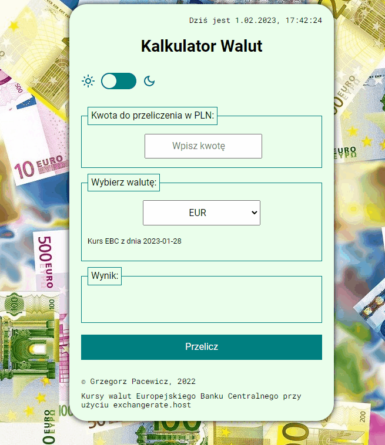

# Kantor

## [Demo version](https://grzegorzpacewicz.github.io/currency-conventer-react/)

## Basic Info

The project I make during FrondEndDeveloper course: https://youcode.pl/frontend-developer-od-podstaw

## Mannual

1. Put amount of currency you want to exchange in the field "Kwota do przeliczenia w PLN"
2. Choose currency in the field "Wybierz walutę"
3. Press "Przelicz" to see how much money You will get
4. Base currency is PLN
5. One can change theme to dark by clicking the circle in the top of the app
6. All rates are taken from European Central Bank (EBC)

## Technologies used

- html
- css
- js
- BEM
- flex
- grid
- arrow functions
- md
- jsx
- react
- local storage
- styled components
- custom hook: useRef, useState, useEffect
- axios, API
- react-redux
- saga

## Getting Started with Create React App

This project was bootstrapped with [Create React App](https://github.com/facebook/create-react-app).
